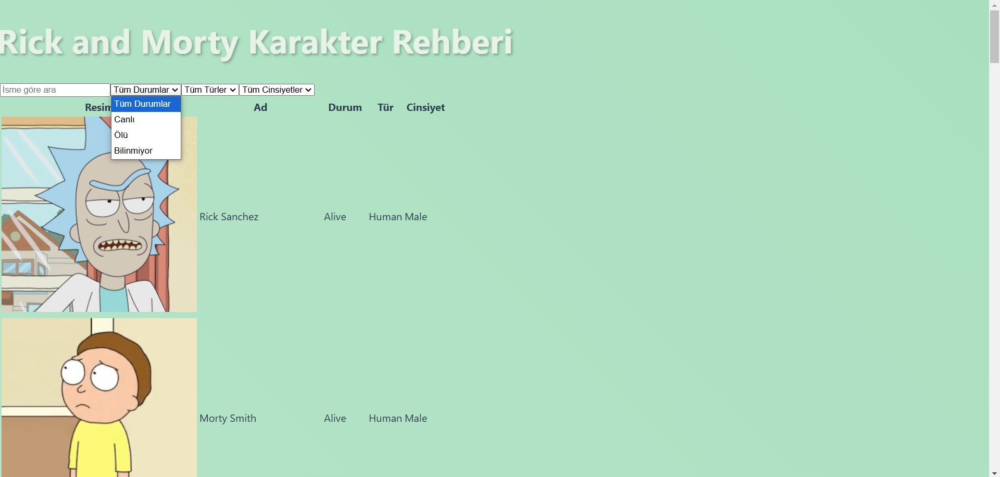

# Rick and Morty API Table 🌍📊

Welcome to the Rick and Morty API Table project! This web application allows you to interact with the official Rick and Morty API, offering a user-friendly interface to filter, sort, and paginate the characters from the show. 🚀

## Project Overview 🔍  
This project creates an interactive table where users can explore characters from the *Rick and Morty* universe. Users can filter the list, sort the data, and view detailed information about each character. 👽👾

## Completed Features ✅  
- **API Integration**: Fetches character data from the [Rick and Morty API](https://rickandmortyapi.com/).  
- **Filter Functionality**: Allows users to filter characters by name or status (e.g., Alive, Dead). 🔎  
- **Sorting Functionality**: Users can sort characters alphabetically by name or by their current status. 🔢  
- **Pagination**: Implements pagination to handle large datasets by limiting the number of characters displayed per page. 📄  
- **Character Details**: When a user clicks on a character's name, detailed information about the character is displayed below the table. 👤

## How to Use 🕹️  
- Browse through the list of characters.  
- Use the filter options to search for characters by name or status. 🔍  
- Sort the table by name or status. 🔀  
- Click on any character to view more detailed information about them. 👁️

## Technical Details 🛠️  
- **Frontend Framework**: React  
- **State Management**: React State  
- **CSS Framework**: Tailwind CSS  
- **API**: [Rick and Morty API](https://rickandmortyapi.com/)

## Screenshots 📸

## License 📄  
This project is licensed under the MIT License - see the [LICENSE](LICENSE) file for details.
